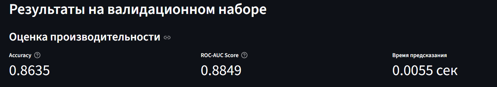
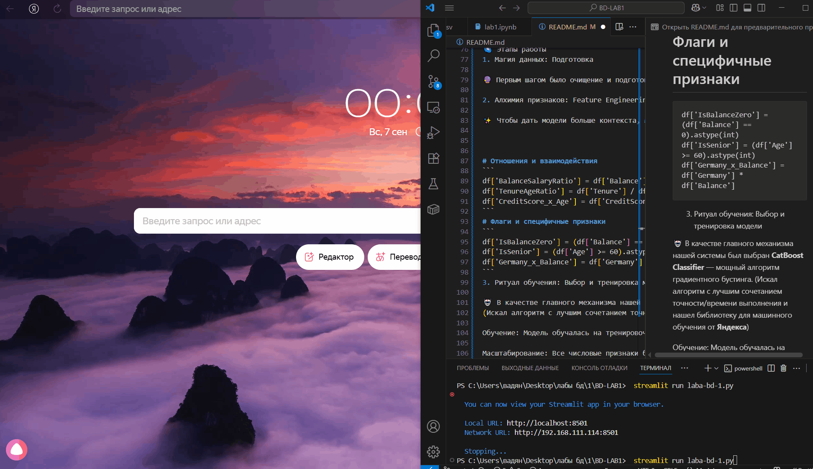

<div align="center">


<h1>🌸 Прогнозирование оттока клиентов банка 🌸</h1>

<p><strong>Аналитическое веб-приложение на Streamlit для предсказания ухода клиентов с использованием градиентного бустинга CatBoost.</strong></p>

<p>


</p>

</div>

<br>

📜 Оглавление

🌸 О проекте

🎯 Задача

🛠️ Технологии и инструменты

🌌 Этапы работы

1. Магия данных: Подготовка

2. Алхимия признаков: Feature Engineering

3. Ритуал обучения: Выбор и тренировка модели

📈 Результаты

✨ Демонстрация

🚀 Как запустить

<br>

🌸 О проекте

Разработка аналитического инструмента. Это полнофункциональное веб-приложение, созданное для предсказания вероятности ухода клиента из банка.

В основе лежит модель CatBoost, которая анализирует данные о клиентах, чтобы выявить скрытые закономерности и с высокой точностью определить тех, кто склонен расторгнуть договор. Все это обернуто в элегантный и интерактивный интерфейс на Streamlit для лучшего визуала.

<br>

<p align="center">

</p>
<br>

🎯 Задача

Основная цель — разработать бинарный классификатор для решения задачи Churn Prediction. Модель должна быть оценена по двум ключевым метрикам на валидационном наборе данных:

Точность (Accuracy) — как часто модель угадывает правильно?

Скорость предсказания — как быстро модель обрабатывает данные?

<br>

🛠️ Технологии и инструменты

Анализ данных	Pandas, NumPy
Машинное обучение	Scikit-learn (для StandardScaler), CatBoost (для основной модели)
Веб-приложение	Streamlit
Визуализация	Plotly Express (для интерактивной матрицы ошибок)
<br>

🌌 Этапы работы
1. Магия данных: Подготовка

🔮 Первым шагом было очищение и подготовка данных. С помощью Pandas мы загрузили датасеты, преобразовали все данные в числовой формат и заполнили редкие пропуски медианными значениями, чтобы не исказить общую картину.

2. Алхимия признаков: Feature Engineering

✨ Чтобы дать модели больше контекста, мы создали новые, более сложные признаки из существующих. Этот процесс, известный как Feature Engineering, позволил уловить скрытые взаимосвязи.


# Отношения и взаимодействия
```
df['BalanceSalaryRatio'] = df['Balance'] / df['EstimatedSalary']
df['TenureAgeRatio'] = df['Tenure'] / df['Age']
df['CreditScore_x_Age'] = df['CreditScore'] * df['Age']
```
# Флаги и специфичные признаки
```
df['IsBalanceZero'] = (df['Balance'] == 0).astype(int)
df['IsSenior'] = (df['Age'] >= 60).astype(int)
df['Germany_x_Balance'] = df['Germany'] * df['Balance']
```
3. Ритуал обучения: Выбор и тренировка модели

🤖 В качестве главного механизма нашей системы был выбран **CatBoost Classifier** — мощный алгоритм градиентного бустинга.
(Искал алгоритм с лучшим сочетанием точности/времени выполнения и нашел библиотеку для машинного обучения от **Яндекса**)

Обучение: Модель обучалась на тренировочном наборе с использованием механизма ранней остановки (early_stopping_rounds). Это позволило найти оптимальное количество итераций и избежать переобучения.

Масштабирование: Все числовые признаки были приведены к единому масштабу с помощью StandardScaler, что является критически важным для стабильности и точности модели.

<br>

📈 Результаты

    Следующие результаты на валидационном наборе:

|Метрика|Значение|Описание|
| :---: | :---: | :---: |
|Accuracy 🎯	[ ~0.8635]-	Доля верных предсказаний|ROC-AUC Score	[~0.8849]-  Комплексная оценка качества классификатора|Время предсказания ⚡[~0.0055 сек]	- Скорость работы на всем валидационном сете|
|  | |  |


<br>

✨ Демонстрация

Интерактивное приложение на Streamlit позволяет не только увидеть результаты, но и сделать прогноз для любого клиента, введя его данные в форму.


<div align="center">

<p><i>Интерфейс приложения для прогнозирования оттока</i></p>
</div>

<br>

🚀 Как запустить

Клонируйте репозиторий:

git clone https://github.com/vadikbee/BD-LAB1.git


Создайте виртуальное окружение (рекомендуется):

Запустите приложение Streamlit:

**streamlit run laba-bd-1.py**

После этого в вашем браузере откроется вкладка с приложением. Наслаждайтесь магией! 💖